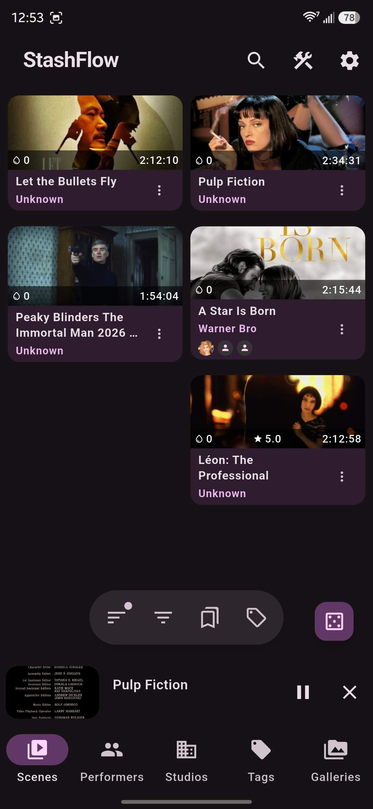

# 📱 StashFlow

### Your Stash library, everywhere

A modern, multi-platform client for your **Stash** server. Built for fast browsing, playback, and library management across **Android**, **Desktop** (Windows, macOS, Linux), and the [**Web**](https://alchemist-aloha.github.io/StashFlow/).

The app is primarily tested on Android and Windows. The web build is best treated as a demo because browser restrictions limit authentication and playback behavior. For the full experience, use a native build.

[](LICENSE)
[](pubspec.yaml)

## 📸 Screenshots

<p align="center">
   
   
   

</p>
<p align="center">
   
   
   
</p>

## ✨ Key Features

### ✨ Key Features

- 📱 **Cross-platform** support for Android, desktop, and web.
- 🧭 **Flexible navigation** with customizable primary tabs and responsive layouts.
- 🎬 **Playback tools** including queue continuity, autoplay next, PiP, background audio, cast support, and subtitle controls.
- 🖼️ **Media browsing** for scenes, markers, images, galleries, performers, studios, tags, and groups.
- 🔎 **Filtering and sorting** with saved per-page defaults and server-side presets.
- 🛠️ **Editing and scraping** for scene metadata, entity associations, and match merging.
- ⚙️ **Settings coverage** for server profiles, interface, playback, storage, security, keybinds, and developer options.
- 🌐 **Localized UI** with multiple supported languages.

## 🚀 Getting Started

### 📱 Android

1. **Download:** Grab the latest APK from the [Releases](https://github.com/Alchemist-Aloha/StashFlow/releases) page.
2. **Connect:** Open the app ➔ Settings ➔ Enter your **Server URL** and **API Key**.

### 💻 Desktop (Windows, macOS, Linux)

1. **Download:** Download the appropriate installer for your OS from the [Releases](https://github.com/Alchemist-Aloha/StashFlow/releases) page.
2. **Setup:** Install and launch ➔ Enter your **Server URL** and **API Key** in Settings.

### 🌐 Web

1. **Access:** Visit the [Live Web App Demo](https://alchemist-aloha.github.io/StashFlow/) or host your own build.
2. **Note on Limitations:** The web version serves primarily as a **demo**.
   - **Authentication:** Only **API Key** login is supported due to browser CORS restrictions.
   - **Playback:** Video playback is limited by browser codec support.
   - **Recommendation:** Use the **Android** or **Desktop** versions for the complete feature set and optimal performance.

---

## 🤓 For Developers

### Tech Stack

- **Flutter** & **GoRouter**
- **Riverpod** & **Hooks** (State Management)
- **GraphQL** (`graphql_flutter` + `codegen`)
- **MediaKit** (High-performance video engine)
- **Audio Service** (Background playback & system controls)

### Project Structure

- `lib/core` shared infrastructure (theme, logs, providers)
- `lib/features/*` feature modules (domain/data/presentation)
- `graphql/` schema and GraphQL documents for code generation

### Build

Use the provided build script to check dependencies, generate code, and build for all available platforms:

```bash
chmod +x build.sh
./build.sh
# or on windows run:
./build.ps1
```

The script will:

1. **Check Dependencies:** Verify that `flutter`, `dart`, `cmake`, `ninja`, and the **Android SDK** are correctly installed.
2. **Fetch Packages:** Run `flutter pub get`.
3. **Generate Code:** Run `build_runner` for GraphQL and Riverpod.
4. **Multi-Platform Build:** Attempt to build for **Android (APK)**, **Web**, **Linux**, **Windows**, and **macOS**, providing a summary of successes and failures at the end.

Or you can build the project manually for a specific platform:

```bash
# Get dependencies
flutter pub get

# Regenerate code (GraphQL & Notifiers)
dart run build_runner build --delete-conflicting-outputs

# Build flutter app
flutter build apk --release --split-per-abi
flutter build windows --release
flutter build linux --release
```

## 📚 Internal Docs

For more info, see:

- [Project wiki page](https://github.com/Alchemist-Aloha/StashFlow/wiki)

## Star History

[](https://www.star-history.com/?repos=Alchemist-Aloha%2FStashFlow&type=date&legend=top-left)
